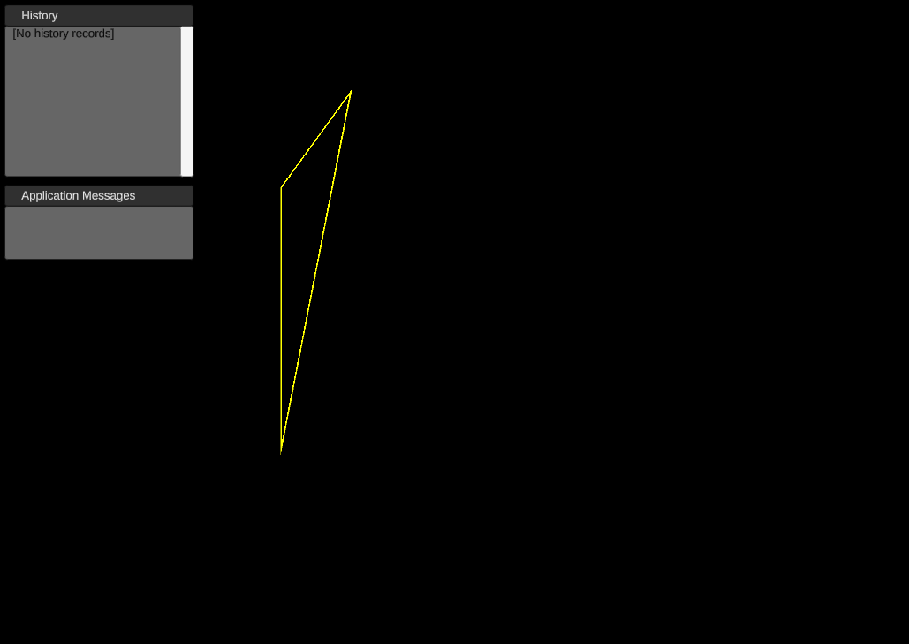

# Выполненное тестовое задание на Unity / C#
- Тематика: простые операции с mesh примитивов, возможность отмены/повторения операций
- Текст самого задания выдается по личному запросу, чтобы он не попал в общий доступ

# Пояснения к реализации
## Функционал приложения

| __Операция__ | __Клавиша по умолчанию__ |
|--------------|--------------------------|
| Добавление треугольников  | C|
| Удаление треугольников    | D| 
| Повтор последней операции | X|
| Отмена последней операции | Z| 

- При успехе вызванной операции производится обновление записей в окне истории операций (Command History) на экране.
- При возникновении ошибки выводится сообщение об ошибке в окно сообщений приложения (Application Messages) на экране.
- Повтор и отмена последних операций основаны на истории сообщений отображающихся в окне Command History. Размер истории ограничен (20 операций по умолчанию. Размер по умолчанию так мал, для того чтобы было проще наблюдать за перезаписью истории при её переполнении).
- Отмена последней операции не записывается в историю операций.

## Окно истории операций (Command History)
При выводе истории операций каждая строка состоит из:
1. Номера операции в списке
2. Названия операции и её параметра (для существующих команд это количество треугольников на которое уменьшается/увеличивается их количество в mesh)
3. Времени проведения операции (номер кадра в hex формате). Добавлено для наглядности, чтобы проще отличать уникальные команды в списке друг от друга

## Окно сообщений приложения (Application Messages)
- При возникновении ошибки при проведении операции выводит номер текущего кадра в hex формате и соответствующее ошибке сообщение.

## Настройки приложения
Основные настройки приложения находятся в ApplicationSettings объекте (Scriptable Object). На его данных основана работа ключевых классов, что позволяет изменять и сохранять параметры во время выполнения тестирования.
Текущие настройки включают в себя: 
1. Назначенные клавиши для операций
2. Размер истории операций
3. Количество добавляемых / удаляемых треугольников

- Главный компонент, отслеживающий происходящее в сцене (ApplicationCore), прикреплён к главной камере.

> Wireframe Shaders для проекта взяты из https://github.com/Chaser324/unity-wireframe/
